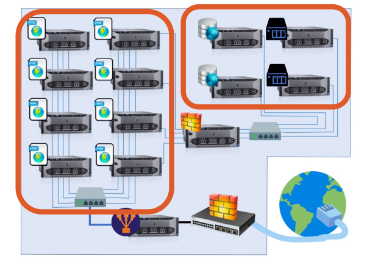

# High-Availability Web Farm Infrastructure

## Overview
This project documents the design, deployment, and continuous optimization of a high-availability web server farm. Built with a DevSecOps and Infrastructure-as-Code mindset, the architecture relies on Dockerized microservices, strict network segmentation, and automated operational scripts to ensure scalability, security, and performance.

## Architecture & Network Design
The infrastructure is designed with security and isolation as core principles, dividing the environment into two distinct networks:

* **`red_web` (Public-Facing - 192.168.10.0/24):** A bridge network accessible by all web server containers. This simulates the public/DMZ tier where incoming HTTP traffic is handled.
* **`red_servicios` (Internal/Private - 192.168.20.0/24):** A strictly internal network (`internal: true`) simulating a secure backend environment (e.g., for future databases or internal APIs). Only designated backend-capable servers (Apache) have access to this network, effectively isolating frontend-only servers (Nginx, Lighttpd) from critical data tiers.



## Technology Stack
* **Containerization:** Docker, Docker Compose
* **Web Servers:** Apache (PHP processing), Nginx (Static assets), Lighttpd (Lightweight operations)
* **Scripting & Automation:** Bash, CLI utilities (curl, netstat, iproute2)
* **OS/Environment:** Debian Bullseye, Linux Networking

## Project Phases

### Phase 1: Container Infrastructure & Network Segmentation (`P1_Container_Infrastructure`)
This initial phase establishes the foundational container grid and operational scripts:
* **Multi-Server Deployment:** Orchestration of 8 concurrent web server replicas using a single `docker-compose.yml`.
* **Diversified Web Engines:** Strategic allocation of web engines based on operational strengths:
    * `web1` to `web4`: **Apache + PHP** (Dynamic content processing, full network access).
    * `web5` & `web6`: **Nginx** (High-performance static content delivery, restricted to `red_web`).
    * `web7` & `web8`: **Lighttpd** (Low-resource footprint, restricted to `red_web`).
* **Server Hardening & Optimization:**
    * Automated PHP limit adjustments (`memory_limit=256M`, `upload_max_filesize=64M`) via `sed` stream editor during image build.
    * Explicit `ServerName` configurations to prevent DNS resolution leaks and warnings.
    * Enabling Apache's `mod_rewrite` for clean URL routing.

### Automation & Monitoring (Bash Operations)
To maintain the infrastructure without manual intervention, custom Bash scripts manage the lifecycle of the containers:

1.  **Deployment & Health Checks (`automatizacion.sh`):**
    * Automatically deploys the Docker Compose stack in detached mode.
    * Dynamically identifies the server type (Apache/Nginx/Lighttpd) running in each container.
    * Performs non-destructive log rotation (`truncate -s 0`) to clear access logs without stopping the daemon.
    * Executes HTTP status code validation (accepting 200, 403, 404 as healthy daemon responses) using `curl`.
2.  **Resource Auditing (`monitoreo.sh`):**
    * Fetches real-time CPU and RAM usage via `docker stats`.
    * Verifies internal TCP port binding (Port 80) using `netstat` directly inside the containers to guarantee service availability at the network layer.

## How to Run
1. Clone the repository and navigate to the Phase 1 directory:
   ```bash
   git clone [https://github.com/gmaartin/High-Availability-Web-Farm.git](https://github.com/gmaartin/High-Availability-Web-Farm.git)
   cd High-Availability-Web-Farm/P1_Container_Infrastructure

2. Execute the automation script to deploy the infrastructure and perform the initial health check:
   ```bash
   sudo ./scripts/automatizacion_gmartinsanchez.sh

3. Run the monitoring script to audit real-time resources:
   ```bash
   sudo ./scripts/monitoreo_gmartinsanchez.sh
